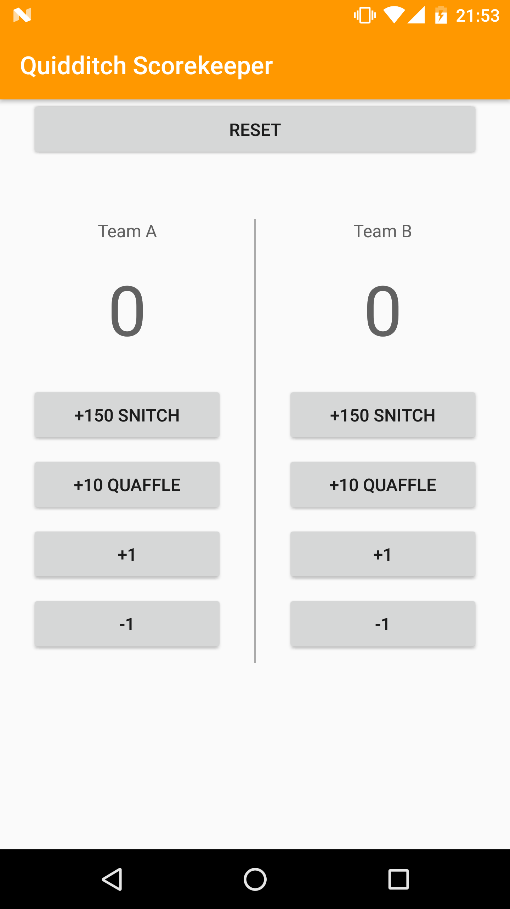

# Android Quidditch Score Tracker
- Project **Score Keeper App** of Android Basics Nanodegree
- [Android Basics Nanodegree at Udacity.com](https://www.udacity.com/course/android-basics-nanodegree-by-google--nd803).

# Description 
- App to track the scores during a Quidditch game, a game that appears on Harry Potter's books.
- [Read more](https://en.wikipedia.org/wiki/Quidditch)

# Score System
There are three type of balls: Quaffle ball, Bludgers and the Snitch. 
- Bludgers try to knock players off their brooms, but doesn't affect to score. 
- Team that throws a **Quaffle ball** and goes through the hoop, scores **10 points**. 
- Catching the **Snitch** adds **150 points** and ends the game. 
- +/- points for penalties
- Once the Snitch is catched, the team with more points wins. 

# Screenshot
